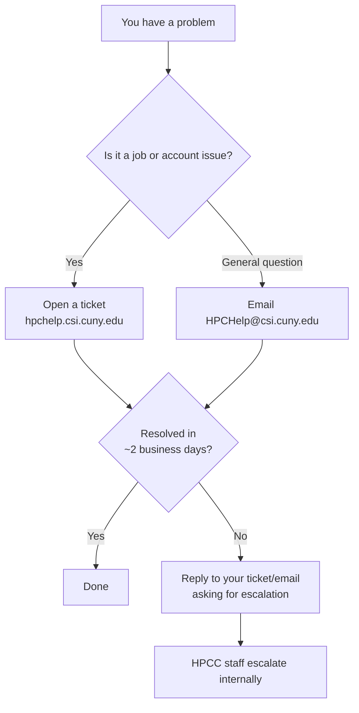

CSI HPCC runs a small team with a clear support chain. Following it gets you help faster than routing around it.

<Warning>
  **Don't email HPC staff directly about job problems.** E-mails asking for help with jobs that are addressed to staff by name will not be answered, and the issue won't get resolved. Use the ticket system or helpline first.
</Warning>

## Support chain

## Where to send what

| Contact | Method | When to use |
| --- | --- | --- |
| **HPC Helpline** | Email [HPCHelp@csi.cuny.edu](mailto:HPCHelp@csi.cuny.edu) | General questions, account requests, software install requests, password resets, anything not job-specific. |
| **HPCC ticket system** | [hpchelp.csi.cuny.edu](https://hpchelp.csi.cuny.edu) | **Job-related problems.** Use this first for anything involving a specific job or account. |
| **HPCC Director** | Alexander Tzanov, PhD, CSI HPCC Director | Escalation **only** after the helpdesk has been given a chance to resolve. |
| **Systems Administrator** | Bimal Kulasekara, HPC Systems Administrator | Escalation **only** after the helpdesk has been given a chance to resolve. |
| **CSI IT Help Desk** | CSI campus IT | Campus network, CUNYfirst credentials, unrelated IT issues. |

<Note>
  Staff phone numbers, office locations, and helpdesk appointment hours change over time. Confirm current specifics on the [CSI HPCC page](https://www.csi.cuny.edu/academics-and-research/research-centers/cuny-high-performance-computing-center) before distributing them; don't copy numbers from secondary sources.
</Note>

## How to write a useful support request

Tickets that include the right information are resolved faster. Include:

- **Your username** and the **system** you're on (`arrow`, `penzias`, etc.).
- The **job ID** if the issue is job-related (`squeue -u $USER` or `sacct` to find it).
- **Exactly what you ran**: the `sbatch` command or SLURM script, not a summary.
- **Exactly what happened**: error output, screenshots, or the content of `slurm-<jobid>.out` / `.err`.
- **When it happened**: timestamp or "submitted ~14:30 today".
- **What you've already tried.**

A good first message saves a round-trip.

## When to escalate

If your ticket or email has gone **~2 business days** without a response or resolution:

1. **Reply to your existing thread** and note that you'd like to escalate. Don't open a new ticket; it splits the history.
2. If the issue is urgent (e.g., a cluster is down and your research deadline is blocked), say so explicitly in the reply.
3. Only after that, if still no movement, contact the Director.

## Support hours

The HPC Helpline monitors email during normal business hours. After-hours email is still answered but response is slower. For urgent issues (outage, security incident) mark your subject line with `URGENT` or `SECURITY`.

<Note>
  Confirm current support hours and any drop-in helpdesk appointments on the [HPCC Wiki's training page](https://wiki.csi.cuny.edu/cunyhpc/index.php/Training_and_workshops) before publishing specific times.
</Note>

## Training and learning resources

See [Training & events](/training) for workshops, seminars, and one-on-one help options.
