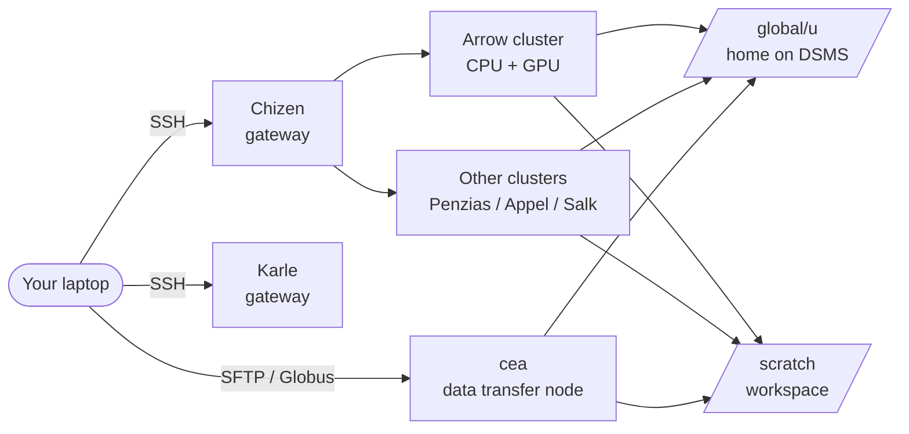

CSI HPCC operates several computer systems grouped into three service tiers — **free tier (FT)**, **advanced tier (AT)**, and **condo tier (CT)** — plus the standalone **Arrow** server. Jobs target different clusters depending on your project, QOS, and partition. When in doubt, Arrow is the current default for new users.

## Architecture at a glance

Only **Chizen** and **Karle** are reachable from outside the CSI network. All other systems require logging into a gateway first. Bulk data transfer runs through **cea**.

## Arrow

Arrow is the current flagship hybrid CPU + GPU cluster and is where most new workloads are placed.

- **Scheduler:** SLURM.
- **Module system:** LMOD (Lua-based, supports hierarchies).
- **GPU config:** up to **8 GPUs per node** on Arrow — request them with `--gres=gpu:N`.
- **Workspace:** jobs **must** start from `/scratch/<username>`. Launching from `/global/u/<username>` is not supported.

<Note>
  Exact per-node specifics (CPU model and core count, RAM, GPU model and memory, interconnect) should be filled in here against authoritative HPCC sources before publishing. The unaudited research draft for this site cited figures like "62 nodes, 64 cores/node, 8× NVIDIA A40 80GB, 2 TB RAM" — treat those as placeholders until confirmed on the [HPCC Wiki](https://wiki.csi.cuny.edu/cunyhpc/index.php/Main_Page) or by a sysadmin.
</Note>

## Other systems

CSI HPCC has historically operated additional clusters. Depending on what's currently in service for your project you may use one or more of:

- **Penzias** — Intel Sandy Bridge cluster with NVIDIA GPU partitions. Uses the older **TCL** modules system (not LMOD). Divided into virtual nodes optimized for medium-size jobs.
- **Appel** — partitions `partnsf`, `partchem`, `partmath` with **mixed GPU types** (A30, A40, A100). Constrain on the type you need with `--constraint` (see [Job submission](/job-submission#gpu-with-a-specific-type)).
- **Salk** — Cray XE6m, reserved for **large parallel jobs** (more than 64 cores), emphasizing environmental sciences and astrophysics.

<Note>
  Service status of Penzias, Appel, and Salk changes over time as systems are retired or repurposed. Before directing users to a specific cluster, confirm it's still in production. The canonical list lives on the [HPCC Wiki](https://wiki.csi.cuny.edu/cunyhpc/index.php/Main_Page).
</Note>

## Service tiers

Jobs across the HPCC are served from three tiers plus Arrow:

| Tier | Purpose |
| --- | --- |
| **Free tier (FT)** | General-purpose allocation available to all approved users. |
| **Advanced tier (AT)** | Higher-priority allocation for approved projects. |
| **Condo tier (CT)** | Dedicated hardware purchased by a PI or group. |
| **Arrow** | Hybrid CPU + GPU cluster operated as a standalone resource. |

The tier that applies to your project determines which QOS and partition you pass in your SLURM scripts. Ask your PI or the [HPC Helpline](mailto:HPCHelp@csi.cuny.edu) if you're unsure.

## File systems

- **`/global/u/<username>`** — your **home directory**, hosted on DSMS, backed up to tape. Small quota, but durable.
- **`/scratch/<username>`** — your **scratch workspace**, large but **ephemeral**. Not backed up. Files can be purged when the filesystem exceeds ~70% full or after about **two weeks**.
- **Project directories** may be provisioned for group work under request.

See [Storage & quotas](/storage) for sizes, purge rules, and how to move data in and out.

## Next steps

<CardGroup cols={2}>
  <Card title="Software & modules" icon="boxes-stacked" href="/software-modules">
    Use LMOD to get compilers, MPI, and applications into your environment.
  </Card>
  <Card title="Job submission" icon="play" href="/job-submission">
    SLURM templates that pair with each system and tier.
  </Card>
</CardGroup>
